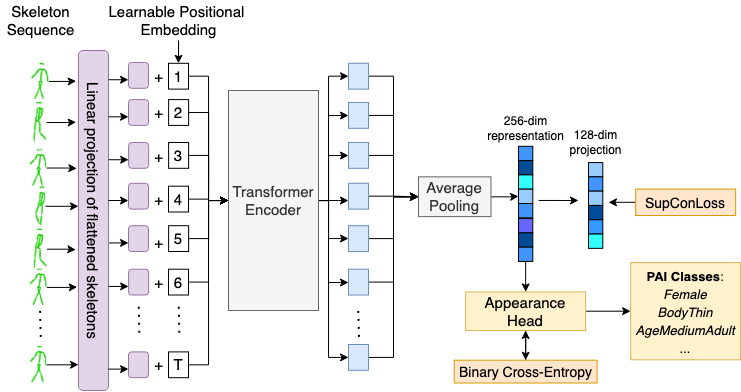
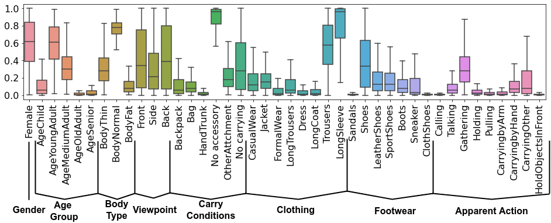

# Official repository for "Learning Gait Representations with Noisy Multi-Task Learning"

### Abstract

*Gait analysis is proven to be a reliable way to perform person identification without relying on subject cooperation. Walking is a biometric that does not significantly change in short periods of time and can be regarded as unique to each person. So far, the study of gait analysis focused mostly on identification and demographics estimation, without considering many of the pedestrian attributes that appearance-based methods rely on. In this work, alongside gait-based person identification, we explore pedestrian attribute identification solely from movement patterns. We propose DenseGait, the largest dataset for pretraining gait analysis systems containing 217K anonymized tracklets, annotated automatically with 42 appearance attributes. DenseGait is constructed by automatically processing video streams and offers the full array of gait covariates present in the real world. We make the dataset available to the research community. Additionally, we propose GaitFormer, a transformer-based model that after pretraining in a multi-task fashion on DenseGait, achieves 92.5% accuracy on CASIA-B and 85.33% on FVG, without utilizing any manually annotated data. This corresponds to a +14.2% and +9.67% accuracy increase compared to similar methods. Moreover, GaitFormer is able to accurately identify gender information and a multitude of appearance attributes utilizing only movement patterns.*



### Getting Started

In this work, we proposed the DenseGait dataset, an automatically gathered dataset with 217k pose sequences and 42 appearance attributes, and GaitFormer, a transformer model for gait recognition, which operates on sequences of skeletons.

The 42 attributes are described below:




The automatic annotation process is showcased below. For more details, refer to our paper.


DenseGait can be downloaded at: 
`https://bit.ly/3SLO8RW`
The dataset is under open credentialized access. To request access, email Adrian Cosma at `cosma.i.adrian@gmail`.

The implementation for GaitFormer can be found in `models/gaitformer.py`.

This repo is based on [acumen-template](https://github.com/cosmaadrian/acumen-template) to organise the project, and uses [wandb.ai](https://wandb.ai/) for experiment tracking. We adapted the implementation of ST-GCN from https://github.com/yysijie/st-gcn 

### Citation

If you found our work useful, please cite our works:

[Learning Gait Representations with Noisy Multi-Task Learning](https://www.mdpi.com/1424-8220/22/18/6803)

```
@Article{cosma22gaitformer,
  AUTHOR = {Cosma, Adrian and Radoi, Emilian},
  TITLE = {Learning Gait Representations with Noisy Multi-Task Learning},
  JOURNAL = {Sensors},
  VOLUME = {22},
  YEAR = {2022},
  NUMBER = {18},
  ARTICLE-NUMBER = {6803},
  URL = {https://www.mdpi.com/1424-8220/22/18/6803},
  ISSN = {1424-8220},
  DOI = {10.3390/s22186803}
}
```

This work relies on our previous paper [WildGait: Learning Gait Representations from Raw Surveillance Streams](https://www.mdpi.com/1424-8220/21/24/8387). Please consider citing with: 

```
@Article{cosma20wildgait,
  AUTHOR = {Cosma, Adrian and Radoi, Ion Emilian},
  TITLE = {WildGait: Learning Gait Representations from Raw Surveillance Streams},
  JOURNAL = {Sensors},
  VOLUME = {21},
  YEAR = {2021},
  NUMBER = {24},
  ARTICLE-NUMBER = {8387},
  URL = {https://www.mdpi.com/1424-8220/21/24/8387},
  PubMedID = {34960479},
  ISSN = {1424-8220},
  DOI = {10.3390/s21248387}
}
```
### License
This work is protected by CC BY-NC-ND 4.0 License (Non-Commercial & No Derivatives). 
